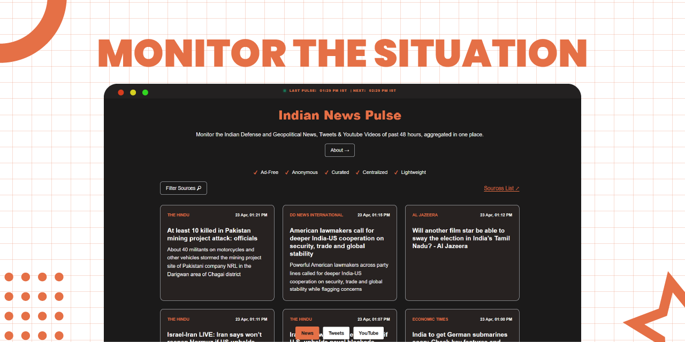

*Static Website to Monitor the Situation.*

### Project Purpose
[India Pulse](https://indipulse.in) is a aggregator website for Indian Defense and Geopolitical news, social media updates (X/Twitter), and YouTube content.
* **Target Audience:** Indian users looking for a clean, ad-free monitoring tool.
* **Core Value:** Ad-free, Anonymous, Curated, and Centralized.

### Technical Architecture
The project uses a **Static Site Generation (SSG)** approach where data is updated periodically by a python script rather than a live server side database.

#### 1. Backend Engine (`aggregator.py`)
* **Logic:** Uses `feedparser` to parse RSS/Atom feeds defined in `feeds.json`.
* **Window:** Strictly filters for content from the **last 48 hours** to keep the feed fresh.
* **Timezone:** Processes and labels all data in **Indian Standard Time (IST)**.
* **Output:** Overwrites a flat `data.json` file which acts as the database.

#### 2. Data Layer (`data.json`)
* **Structure:**
    * `news`: Title, link, source, time, and 150-char truncated description.
    * `youtube`: Title, link, source, time, and auto-generated thumbnail URL.
    * `tweets`: Content, link, Image, Video, Re-tweet, Repost, source, and time.
    * `metadata`: Stores `last_updated` strings.

#### 3. Frontend (`index.html` + `app.js`)
* **Framework:** No frameworks (No React/Vue/Tailwind). Uses **Vanilla JavaScript** and minimalist oat library [`@knadh/oat`](https://github.com/knadh/oat/).
* **State Management:** Uses a `Set` for `activeSources` to allow real-time client-side filtering.
* **Rendering:** Uses a tabbed system (News/Tweets/YouTube) with a shared `render()` function generating HTML cards dynamically.
* **Cache Busting:** Fetches `data.json?v=[timestamp]` to bypass browser caching and show real-time updates.